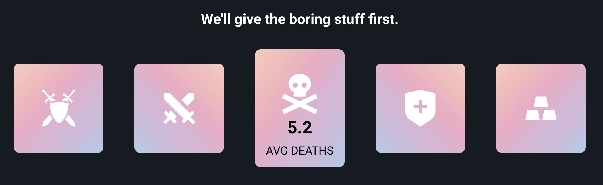

  

## Table of Contents

1. [Purpose](#Purpose)
2. [Journey](#Journey)
3. [Demo](#Demo)
4. [Technologies Used](#Technologies)

## Purpose

The purpose of this application was to enable competitive League of Legends players a way to understand their current season stats in a fun and interactive fashion. We acknowledged that there are a lot great websites out there already that focus on a player's stats, but we wanted to add a new twist and engineer a UI that incorporated modern designs, while allowing the users to understand their stats more holistically through charts and graphs.

Fun Fact:

We came up with the name "ngL" based on two facts:
  1. The main reason being that our app was "not gonna lie" (like the acronym ngl) about your stats. HAHAHAHA... sorry, we know we are lame.
  2. Both of our last names end in "-ng" (Hong and Kang)

## Journey

### Jason's Perspective

While developing this app, one obstacle we had to overcome was the fact that our website looked very two-dimensional. This "flat" feeling elicited unpleasant experiences from a UX standpoint and in order to correct this, I decided to implement modern card designs. Card designs seemed like the perfect fit for our website because cards are naturally inutitive as units of information. To prevent the website from being a boring stat page, I added different hover effects for each respective module. To witness it yourself, check out the demo below!

## Demo

<b>Full demo:</b> https://youtu.be/V_nVUjMSxNI

Screenshots to compare **v1** to **v2**:

| Version 1 | Version 2 |
|:------:|:-------:|
| | 
| | 
| | 

## Technologies

| Technologies Used |
|-------------------|
| React |
| styled-components |
| Axios |
| Redis |
| Chart.js |
| Amazon S3 |
| Node.js |
| Express.js |
| Webpack |
| Babel |